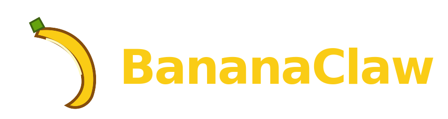
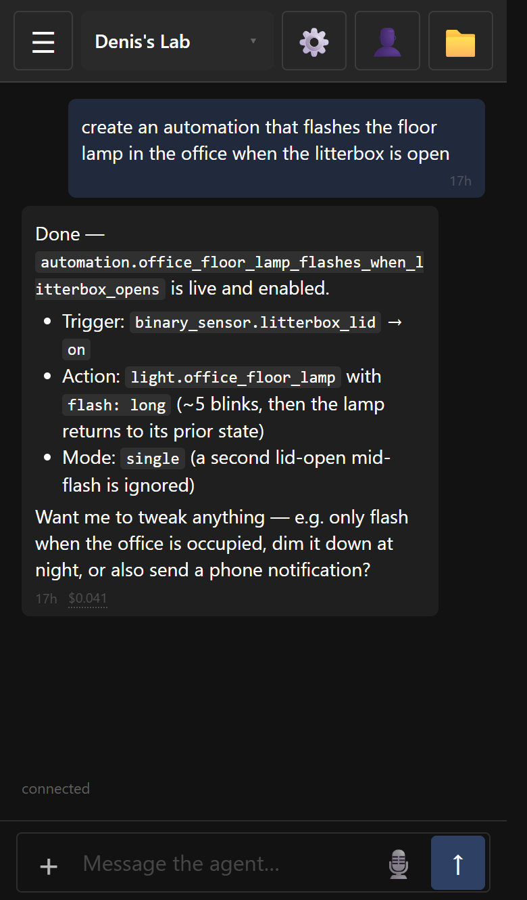

<p align="center">
  
</p>

<p align="center">
  <strong>A personal AI assistant you actually live in.</strong><br>
  Web-first · installable PWA · container-isolated · voice-aware · OIDC-secured.
</p>

<p align="center">
  <a href="https://denis.adsoconsulting.org/nanoclaw/">Marketing site & full feature tour →</a>
</p>

<p align="center">
  
</p>

---

## Credit

BananaClaw is a fork of [**NanoClaw**](https://github.com/nanocoai/nanoclaw) by
**Gavriel Cohen** and the [NanoClaw contributors](CONTRIBUTORS.md). The runtime
— host router, two-DB session protocol, per-session container model, Claude
Agent SDK integration, skills-as-branches, OneCLI credential isolation — is
NanoClaw's, line-for-line. Upstream's README is preserved as
[README.nanoclaw.md](README.nanoclaw.md).

What BananaClaw adds is everything *around* the runner: a real web UI, push
notifications, login, file browser, voice composer, public site hosting, and
rootless Podman support — the surfaces a person uses day-to-day to talk to
their agents.

If you want the minimal, audit-it-yourself runtime, run upstream NanoClaw.
If you want to use it from your phone the way you'd use a normal app, run
BananaClaw.

## NanoClaw vs. BananaClaw

| Area | NanoClaw (upstream) | BananaClaw (this fork) |
|---|---|---|
| **Primary surface** | Messaging apps | Web UI (PWA) + messaging apps |
| **Web UI** | — | Preact chat app at `/ui/chat`, mobile + desktop layouts |
| **PWA / install** | — | Installable on iOS, Android, macOS, Windows |
| **Push notifications** | — | Web Push, wakes the device when PWA closed |
| **Admin UI** | `ncl` CLI | Browser admin pane: models, params, packages, MCP servers, skills, restart |
| **Voice / STT** | Per-channel only | In-browser voice composer, per-agent transcription, send-while-recording |
| **File browser** | Container FS only | Web file browser: preview, upload, mkdir, rename, delete, drag/drop, "send to chat" |
| **Public hosting** | — | "Pages": per-group subdomain, served by host, path-traversal sealed |
| **Auth** | Magic links | Magic links + Google OIDC + generic OIDC, first-login onboarding wizard |
| **Container runtime** | Docker, Apple Container | Docker, Apple Container, **rootless Podman** (auto-detected) |
| **Email channel** | — | Native Resend adapter + email-bot personas, owner replyTo+bcc, attachments |
| **Home Assistant** | — | Native `webhook-conversation` adapter |
| **OpenCode integration** | Skill-installed adapter | Skill + per-group `model_params`, per-group `small_model`, progress hints, error replay, idle-timeout knob |
| **Browser as channel** | — | `web` channel adapter — each tab is a thread |
| **Self-mod model params** | `install_packages`, `add_mcp_server` | Above + `model_params` get/set/unset, container restart with on-wake message |
| **Stay-small philosophy** | Trunk is registry + infra only | Trunk includes UI + auth + hosting; channels/providers still skill-installed |
| **License** | MIT | MIT |
| **Upstream merges** | n/a | NanoClaw half merges cleanly; BananaClaw half is additive |

See the [marketing site](https://denis.adsoconsulting.org/nanoclaw/) for screenshots and a full feature tour.

## Quick start

```bash
git clone https://github.com/dtreskunov/nanoclaw.git bananaclaw
cd bananaclaw
bash nanoclaw.sh
```

The installer is upstream's `nanoclaw.sh` with two extra prompts at the end:
enable the web UI, and configure an OIDC provider. Both are optional;
everything still works headless.

After install, open `http://localhost:3000/ui/chat`. To get a login link:

```bash
pnpm exec tsx src/ui/scripts/mint-magic.ts --list   # find your user id
pnpm exec tsx src/ui/scripts/mint-magic.ts <id>     # prints a magic-link URL
```

…or, once OIDC is configured, just sign in with Google.

## Architecture

Identical to upstream:

```
messaging apps  ┐
web (browser)   ├─→  host (router) → inbound.db → container (Bun, Agent SDK)
HA / email      ┘                                       │
                                                        ↓
                              host (delivery) ← outbound.db
```

The `web` channel sits in this same flow — the browser is just another
adapter. Admin UI, file browser, and Pages are separate HTTP routes on the
same listener; none bypass the session-DB protocol.

Per the [upstream architecture docs](docs/architecture.md): two SQLite files
per session, exactly one writer each, no IPC. BananaClaw changes none of
this.

## Documentation

Upstream docs apply unchanged:

- [docs/architecture.md](docs/architecture.md) — host + container + session DBs
- [docs/db.md](docs/db.md), [docs/db-central.md](docs/db-central.md), [docs/db-session.md](docs/db-session.md)
- [docs/isolation-model.md](docs/isolation-model.md) — channel isolation levels
- [docs/agent-runner-details.md](docs/agent-runner-details.md) — MCP tools

BananaClaw-specific:

- [docs/ui.md](docs/ui.md) — web UI server, auth shell, apps
- [docs/pages.md](docs/pages.md) — per-group public static websites
- [docs/ollama.md](docs/ollama.md) — local model providers

## Contributing

Bug fixes and improvements to the BananaClaw half (UI, push, OIDC, Pages, web
channel, Podman, OpenCode enhancements, HA adapter) are welcome here.

Changes to the NanoClaw half — host router, delivery loop, session manager,
container runner, agent-runner, central DB schema — should go to
[upstream NanoClaw](https://github.com/nanocoai/nanoclaw) first. BananaClaw
picks them up on the next merge. This keeps the runtime canonical and the
maintenance burden honest.

New channels and providers follow the upstream **skills-as-branches** model.

## License

MIT — same as upstream NanoClaw. See [LICENSE](LICENSE).

The original NanoClaw code is copyright © Gavriel Cohen and the NanoClaw
contributors. BananaClaw additions are released under the same MIT terms.
